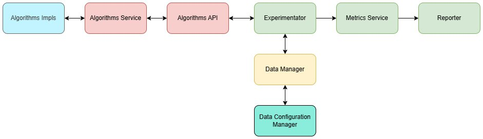

# Архитектура приложения

[Описание каждого компонента](architecture-components.md)

## Библиотека 
Наша библиотека предоставляет наружу ряд функций, для решения задачи о рюкзаке. 
Все предоставляемые методы доступны из Atgorithms Service. Внутренняя логика, при этом описывается в Algorithms Service, который в свою очередь объединяет описанные в разных файлах реализации алгоритмов. 
С Algorithms Service связаны и тесты, которые вызывают его функции для проверки корректной работы API. 

## Среда для сравнения
Точкой входа является функция main в файле src/main.rs. Она запускает процесс экспериментов по сравнению алгоритмов решения задачи о рюкзаке. Сначала, используя Data Manager, происходит чтение конфигурации эксперимента из файла experiment.json. Эта конфигурация определяет, какие алгоритмы будут тестироваться, параметры генерации тестовых данных (размер рюкзака, количество предметов, диапазон весов и стоимостей) и количество тестовых наборов данных (knapsacks). Если необходимо сгенерировать данные, Data Configuration Manager используется для создания наборов данных (рюкзаков) с указанными параметрами.

Далее, создается экземпляр Bencher (Metrics Service), которому передаются алгоритмы из Algorithms Service и сгенерированные рюкзаки. Он проводит эксперименты над алгоритмами решения задачи о рюкзаке, используя библиотеку Criterion для бенчмаркинга.Bencher получает набор алгоритмов из Algorithms Service и проводит серию измерений для каждого алгоритма. В процессе измерений отслеживаются:
- Время выполнения (среднее, медиана, стандартное отклонение)
- Процент успешных решений (относительно лучшего найденного результата)
Результаты экспериментов форматируются в виде Markdown-таблиц и сохраняются с помощью Reporter. Дополнительно Data Collector собирает графики производительности в формате SVG, которые перемещаются в соответствующую директорию assets.